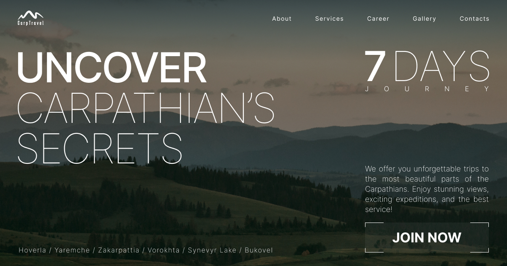

# Carptravel Project 🎣

Welcome to the Carptravel project! This is a web application built using Typescript, Next.js, Tailwind CSS, and deployed on Vercel. The project aims to provide travel enthusiasts with information about various destinations for carp Travelling and fishing. 🌍🐟



## Demo 🚀

Check out the live demo of the Carptravel project: [https://carptravel-ts.vercel.app/](https://carptravel-ts.vercel.app/) 🌐

## Features ✨

- Browse and explore various destinations for travelling. 🌎
- View detailed information about each destination, including photos and descriptions. 📸
- Responsive design for seamless usage on different devices. 📱💻
- Fast and efficient performance powered by Next.js and optimized with Tailwind CSS. ⚡

## Getting Started 🚀

To get started with the project locally on your machine, follow the instructions below.

### Installation 📦

1. **Clone the repository:**

   ```bash
   git clone https://github.com/sergio-nezhigay/carptravel-ts.git
   ```

2. **Navigate to the project directory:**

   ```bash
   cd carptravel
   ```

3. **Install dependencies:**

   ```bash
   npm install
   ```

### Usage 🏃

1. **Run the development server:**

   ```bash
   npm run dev
   ```

2. **Open your browser:**

   The application will be available at [http://localhost:3000](http://localhost:3000). You can start exploring the app from there.

## Technologies 🛠️

Certainly! Here are 10 popular technologies from your list presented in a similar format:

## Technologies 🛠️

Certainly! Here's the updated list without numbers:

## Technologies 🛠️

-Certainly! Here's the updated list with the Shadcn Component Library link:

## Technologies 🛠️

- **[TypeScript](https://www.typescriptlang.org/)** - Adds static typing to JavaScript for enhanced development. 📝
- **[React](https://reactjs.org/)** - A JavaScript library for building user interfaces. ⚛️
- **[Next.js](https://nextjs.org/)** - React framework for building server-rendered applications. ⚛️
- **[Shadcn Component Library](https://ui.shadcn.com/)** - Leveraging the Shadcn library for reusable and aesthetically pleasing UI components. 🧰
- **[Tailwind CSS](https://tailwindcss.com/)** - A utility-first CSS framework for rapid UI development. 🎨
- **[Swiper](https://swiperjs.com/)** - A modern mobile touch slider library. 📱
- **[Zod](https://github.com/colinhacks/zod)** - A TypeScript-first schema declaration and validation library. 🚀
- **[React Hook Form](https://react-hook-form.com/)** - A library for managing forms in React using hooks. 📝
- **[Prettier](https://prettier.io/)** - An opinionated code formatter for JavaScript, TypeScript, and more. ✨
- **[ESLint](https://eslint.org/)** - A pluggable and configurable linter tool for identifying and fixing problems in JavaScript code. 🧹
- **[Vercel](https://vercel.com/)** - A platform for deploying web applications. 🚀
- **[clsx](https://github.com/lukeed/clsx)** - A utility for conditionally joining class names together. 🧩

This list now includes the link to the Shadcn Component Library for reference.

This list provides a snapshot of various technologies used in web development, covering frameworks, libraries, tools, and more.

These technologies cover a wide range of web development aspects, from front-end libraries and frameworks to tools for code quality and deployment.

## Contributing 🤝

Contributions are welcome! If you find any issues or have suggestions for improvements, feel free to open an issue or submit a pull request.

1. Fork the repository. 🍴
2. Create a new branch: `git checkout -b feature-new-feature`. 🌿
3. Make your changes and commit them: `git commit -m 'Add new feature'`. 💬
4. Push to the branch: `git push origin feature-new-feature`. 🚀
5. Open a pull request. 📤

## License 📃

This project is [MIT licensed](LICENSE). 📜

## Contact Information 📧

- **Author:** Serhii Nezhyhai
- **Email:** [abc1971h@gmail.com](mailto:abc1971h@gmail.com)
- **Portfolio:** [https://serhii.vercel.app/](https://serhii.vercel.app/)
